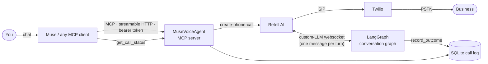
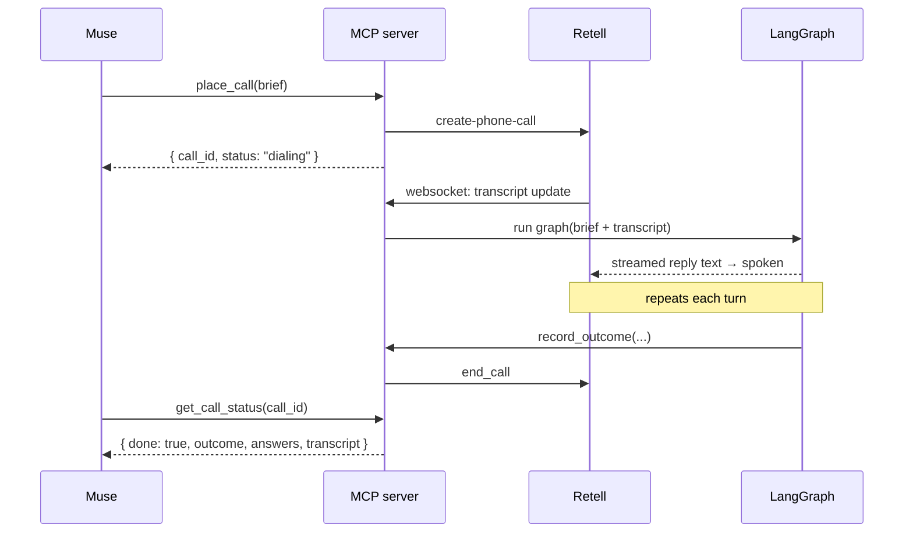

# MuseVoiceAgent

**Give your AI assistant a phone.** MuseVoiceAgent is an [MCP](https://modelcontextprotocol.io) server
that lets an AI assistant (built for Meta Muse, works with any MCP client) phone real businesses on
your behalf. It can book a table, get a handyman quote, check hotel availability, or ask whether
your repair is ready, and it reports back a structured result.


```text
You    → Muse:  "Call Hotel Zed and ask if they have a king room Oct 10–12 and the rate. Don't book."
Muse   → place_call(business_name="Hotel Zed", goal=..., questions=[...], authority="info_only")
Agent  ☎  "Hi, this is an assistant calling on behalf of Alex. Do you have a king room…"
Hotel  ☎  "We do, $289 a night plus tax."
Agent  → { "outcome": "info_received",
           "answers": [{ "question": "King room Oct 10–12?", "answer": "Yes" },
                       { "question": "Nightly rate?",         "answer": "$289 + tax" }] }
Muse   → You:   "Hotel Zed has a king room for those nights at $289/night plus tax."
```

## Why it's interesting

- **One tool, many errands.** `place_call` takes a *brief* (goal, questions, details it may share,
  and how much authority it has), so you don't build a new flow for every kind of call.
  Restaurant and handyman calls get tuned shortcuts.
- **Results the assistant can use.** Every call ends with a typed `CallOutcome`: `booked`,
  `quote_received`, `info_received`, `voicemail`, and so on. It includes per-question answers,
  confirmation numbers, and the full transcript.
- **Your code decides what's said, Retell handles the phone audio.** Retell AI does dialing,
  speech-to-text, text-to-speech, barge-in and voicemail detection. A LangGraph graph you control
  writes each reply over Retell's custom-LLM websocket.
- **Guardrails enforced in code.** The agent says it's an AI, only dials allowed number prefixes,
  enforces caps on call length and simultaneous calls, rejects card numbers and SSNs, and won't
  report a booking it wasn't allowed to make.
- **Try it without a phone line.** `DRY_RUN=true` simulates calls end to end, so you can wire up
  your assistant before you have any API keys.
- **Runs on free hosting.** It ships as a ~400 MB Docker image (~95 MB RAM), with a built-in
  keepalive for hosts that sleep when idle, such as Render's free plan.

## How it works



1. The assistant calls a tool such as `place_call`. The server checks the brief, applies its limits,
   asks Retell to dial, and **immediately returns a `call_id`**. Phone calls take minutes, and
   MCP tools shouldn't block that long.
2. Retell connects the call and streams the transcript to the server's websocket. On every turn,
   the LangGraph graph (default `gpt-4.1-mini`) reads the conversation and a system prompt built from
   the brief, then streams back what to say next.
3. When the agent has what it needs, it calls the `record_outcome` tool, says goodbye and hangs up.
   A background monitor also tracks Retell's call state, so calls that end without an outcome
   (no answer, voicemail, hang-up) still get a final result.
4. The assistant polls `get_call_status(call_id)` until `done` is true, then tells you the result.



## Quickstart (2 minutes, no keys)

Requires Python 3.12+ and [uv](https://docs.astral.sh/uv/).

```bash
git clone https://github.com/angilyu/MuseVoiceAgent && cd MuseVoiceAgent
uv sync
cp .env.example .env
echo "MCP_AUTH_TOKEN=$(python -c 'import secrets;print(secrets.token_urlsafe(32))')" >> .env

uv run pytest                                              # unit + MCP tests
uv run muse-voice-mcp                                      # terminal 1: server on :8765
uv run python scripts/smoke_test.py --call +14155550123    # terminal 2: simulated booking
```

The smoke test talks to the server over HTTP exactly as an MCP client would. It lists the tools,
starts a simulated call and polls it until it's done.

## MCP tools

| Tool | What it does |
| --- | --- |
| `place_call` | Phone **any** business with a brief: availability checks, questions, simple bookings |
| `book_restaurant_reservation` | Restaurant shortcut (party size, date, time, flexibility) |
| `request_handyman_quote` | Contractor shortcut: price and earliest availability. **Never books.** |
| `get_call_status` | Status, outcome, structured details, optional transcript |
| `list_calls` | Most recent calls |

All three call tools **require `customer_name`**, the person the call is made for. The agent opens
with "Hi, this is an assistant calling on behalf of {customer_name}". Blank or placeholder names
("user", "unknown", …) are rejected with `invalid_request` so the client asks the user first.

### `place_call`: the general-purpose call

```jsonc
{
  "business_name": "Hotel Zed",
  "phone_number": "+15105550123",
  "customer_name": "Wenjing Yu",                           // required: who the call is for
  "goal": "Find out if they have a king room for Oct 10–12 and the nightly rate",
  "questions": ["Is a king room available Oct 10–12?", "What's the nightly rate?"],
  "shareable_details": { "guests": "2 adults" },          // what the agent may say if asked
  "authority": "info_only",                                // or "may_book_within_limits"
  "limits": null                                           // required with may_book, e.g. "under $300/night, no prepayment"
}
```

`authority` controls what the agent may commit to. `info_only` (the default) never agrees to
anything. If the model still claims it booked something, the server downgrades the result to
`needs_followup`. `may_book_within_limits` lets it book only within the `limits` you wrote.

### Result

```jsonc
{
  "call_id": "c_8f2…",
  "status": "completed",          // queued → dialing → in_progress → completed | no_answer | failed
  "done": true,
  "outcome": "info_received",     // booked | quote_received | info_received | unavailable
                                  // | declined | needs_followup | voicemail
  "summary": "Hotel Zed has a king room Oct 10–12 at $289/night plus tax.",
  "details": {
    "answers": [
      { "question": "Is a king room available Oct 10–12?", "answer": "Yes" },
      { "question": "What's the nightly rate?", "answer": "$289 plus tax" }
    ],
    "contact_person": "Dana at the front desk",
    "reference": null,
    "follow_up": null
  },
  "simulated": false
}
```

Depending on the call type, `details` can also include `confirmed_date`, `confirmed_time`, `party_size`,
`booked_under`, `quote`, and `availability`.

## Design decisions

| Decision | Why |
| --- | --- |
| **Retell for audio, LangGraph for the conversation** (custom-LLM mode) | Retell handles the telephony problems (barge-in, voicemail detection, turn-taking) while prompts, tools and model choice stay in code. Retell doesn't bill for the LLM in this mode. |
| **Start the call and poll, instead of one long blocking tool call** | Calls take 1–5 minutes, and most MCP clients time out long before that. |
| **One brief-driven tool plus a few tuned shortcuts** | New kinds of errands need no code. Common ones keep prompts and validation tuned for them. |
| **Hard rules in code, not only in the prompt** | Dial prefixes, call caps, rejecting sensitive data, and downgrading unauthorized bookings all hold even if the model misbehaves. |
| **A pluggable voice backend** | `VOICE_BACKEND=livekit` runs the same graph on LiveKit Agents (`agent.py`) instead of Retell. |
| **A self-contained server** | One process, SQLite, and no queue or worker fleet, so it runs on a free host. |

## Safety and responsible use

- **Authentication.** Every HTTP request needs `Authorization: Bearer <MCP_AUTH_TOKEN>`;
  `/healthz` is the only open path. Retell's websocket can't send headers, so it uses an
  unguessable path secret (`RETELL_WS_SECRET`), and it only attaches to calls this server started.
- **Who it can call.** `ALLOWED_DIAL_PREFIXES` (default `+1`), `MAX_CONCURRENT_CALLS` (default 3) and
  `MAX_CALL_SECONDS` (default 300).
- **Honest.** Every call opens with a fixed line, "Hi, this is an assistant calling on behalf of
  {name}." It's streamed to text-to-speech before the LLM runs, so the business hears it at once.
  If asked, it always says it's an AI, and it never claims to be human.
- **Discreet.** It never shares payment details or addresses, and never agrees to deposits or fees.
  Those cases come back as `needs_followup` for a human to handle.
- **No sensitive input.** Briefs containing Luhn-valid card numbers or SSNs are rejected before
  dialing. Long order or tracking numbers are still allowed.
- **Check local laws** on AI-voice disclosure and call recording before calling real businesses.
  Recommend that your MCP client confirm with the user before each call.

## Going live: real phone calls

You need an [OpenAI](https://platform.openai.com) key, a [Retell AI](https://dashboard.retellai.com)
key, and a [Twilio](https://console.twilio.com) account with a voice-capable number.

1. Put `OPENAI_API_KEY`, `RETELL_API_KEY`, `TWILIO_ACCOUNT_SID` and `TWILIO_AUTH_TOKEN` in `.env`.
2. Create the Twilio Elastic SIP trunk and credentials. The script is safe to re-run:
   ```bash
   uv run python scripts/setup_twilio_trunk.py +1XXXXXXXXXX
   ```
3. Expose the server publicly so Retell and your MCP client can reach it. Use a tunnel for
   development, or [deploy it](#deploy).
   ```bash
   cloudflared tunnel --url http://127.0.0.1:8765
   ```
4. Create the Retell agent and import the number. This writes `RETELL_AGENT_ID`,
   `RETELL_FROM_NUMBER`, `RETELL_WS_SECRET` and `PUBLIC_BASE_URL` to `.env`:
   ```bash
   uv run python scripts/setup_retell.py +1XXXXXXXXXX --public-url https://<your-host>
   ```
5. Set `DRY_RUN=false` and start `uv run muse-voice-mcp`. On startup the server points the Retell
   agent at `PUBLIC_BASE_URL`, so after the URL changes you only need to restart.
6. **Call yourself first:** `uv run python scripts/smoke_test.py --call +1YOURCELL`. Answer as the
   business ("Hello, Test Bistro"). The agent waits for you to speak first.

## Deploy

The `Dockerfile` builds only the MCP server, without the LiveKit extra, and listens on `0.0.0.0:10000`.

**Render (free plan works):**
1. Create a **Web Service** from the repo with runtime **Docker**, region **Oregon** (closest to
   Retell), and health check path `/healthz`.
2. Set these environment variables: `DRY_RUN=false`, `VOICE_BACKEND=retell`, `MCP_AUTH_TOKEN`,
   `OPENAI_API_KEY`, `LLM_MODEL`, `RETELL_API_KEY`, `RETELL_AGENT_ID`, `RETELL_FROM_NUMBER`,
   `RETELL_WS_SECRET`, and `PUBLIC_BASE_URL=https://<service>.onrender.com`.
3. Free instances sleep after 15 idle minutes. Set `KEEPALIVE_SECONDS=600` and the server pings its
   own public `/healthz` to stay awake, using about 744 of the 750 free hours a month. Free disks
   are ephemeral, so the SQLite call log resets on each deploy.

Behind a corporate proxy, build with `--build-arg PYPI_INDEX_URL=<mirror>/simple/`.

## Connect your assistant

Point any MCP client at `https://<your-host>/mcp` (streamable HTTP) with the bearer token. For
**Meta Muse**, send one message:

> Build a custom integration to my phone-calling agent. It's an MCP server over streamable HTTP at
> `https://<your-host>/mcp` and needs a bearer token (ask me through the secure credential flow).
> It can call any business to check availability, ask questions, or book within limits I set.
> Connect, list the tools, test `list_calls`, and save it as a reusable skill. Always confirm the
> business, number, and details with me before starting a call, and require my approval for call tools.

Enter `MCP_AUTH_TOKEN` in Muse's secure credential prompt, never in the chat. Then try:

- *"Book a table for 2 at Luigi's (+1…) Friday at 7:30, flexible 6:30–8:30."*
- *"Get a quote from Bob's Handyman (+1…) to replace a kitchen faucet in Oakland."*
- *"Ask Joe's Bike Shop (+1…) if my repair is ready. The ticket number is 48213."*

## Configuration

All settings come from environment variables or `.env`; see [`.env.example`](.env.example).

| Variable | Default | Purpose |
| --- | --- | --- |
| `DRY_RUN` | `true` | Simulate calls; no keys or phone line needed |
| `VOICE_BACKEND` | `retell` | `retell` or `livekit` |
| `LLM_MODEL` | `openai:gpt-4.1-mini` | Any LangChain `provider:model` |
| `MCP_AUTH_TOKEN` | — | Bearer token clients must send |
| `MCP_HOST` / `MCP_PORT` | `127.0.0.1` / `8765` | Bind address (the Docker image uses `0.0.0.0:10000`) |
| `PUBLIC_BASE_URL` | — | Public https URL; the Retell websocket is synced to it |
| `ALLOWED_DIAL_PREFIXES` | `+1` | Comma-separated E.164 prefixes the agent may dial |
| `MAX_CALL_SECONDS` / `MAX_CONCURRENT_CALLS` | `300` / `3` | Limits on call length and simultaneous calls |
| `RETELL_VOICE_ID` | `cartesia-Cleo` | Retell voice |
| `DEFAULT_CALLBACK_NUMBER` | — | Used when the client doesn't pass one |
| `DEFAULT_CUSTOMER_NAME` | — | LiveKit console agent only. MCP call tools require the client to pass `customer_name` |
| `KEEPALIVE_SECONDS` | `0` | When greater than 0, the server pings its own `/healthz` at this interval |

## Project layout

```text
src/muse_voice_agent/
  mcp_server.py   MCP tools, bearer auth, /healthz, ASGI app
  tasks.py        Brief models (general, restaurant, handyman), validation, system prompts
  graph.py        LangGraph conversation graph and the typed record_outcome tool
  dispatcher.py   Starts calls (Retell, LiveKit, or simulated) and enforces limits
  retell.py       Retell REST client, custom-LLM websocket, call monitor
  agent.py        Optional LiveKit Agents worker (VOICE_BACKEND=livekit)
  store.py        SQLite call log (status, outcome, transcript)
  keepalive.py    Self-ping for hosts that sleep when idle
  config.py       Settings from env
scripts/          Twilio trunk and Retell agent setup, MCP smoke test
tests/            Graph, MCP server, Retell websocket and keepalive tests
```

## Development

```bash
uv run pytest                     # fast; no network or keys needed
uv run muse-voice-agent console   # talk to the graph yourself (LiveKit backend; needs OpenAI + LiveKit keys)
```

Adding a new shortcut takes three steps:
1. Add a brief model and a prompt builder in `tasks.py`.
2. Register a tool in `mcp_server.py`.
3. Add a simulated result in `dispatcher.py`.

Most errands don't need a shortcut, because `place_call` already covers them.

## Evals

The agent is measured by an eval suite of **58 simulated San Francisco Bay Area phone errands**:
restaurants, home services, healthcare, pets, travel, retail and hard cases such as voicemail, IVR
menus and rude hang-ups. The suite is built for hill-climbing prompts, models and graph changes.

- **Text eval:** an LLM plays the business and the real production graph makes the call. The result
  is scored by deterministic safety and outcome checks, TTS-friendliness checks and a six-dimension
  LLM judge. By default it runs on GitHub Copilot models, so iterating costs no OpenAI credits.
- **Voice eval:** scores real Retell calls for latency, barge-ins, dead air and pacing, with an
  optional audio judge.

```bash
uv run --offline python -m evals.text --cases tag:smoke
```

The current baseline is a **62% pass rate** with a **4.24 / 5** average score. See
**[evals/README.md](evals/README.md)** for the case catalog, scoring, model choices, results and
the hill-climbing workflow.

## Roadmap

- [ ] Lower turn latency (faster model, prompt caching, fewer graph steps per turn)
- [ ] Persistent call log (Postgres or a mounted disk) for hosted deployments
- [ ] Callback handling when a business calls the number back
- [ ] Multi-language calls

## License

Copyright © 2026 Wenjing Yu. All rights reserved. This is proprietary software; see [LICENSE](LICENSE).
For licensing or commercial use, contact [@angilyu](https://github.com/angilyu).
