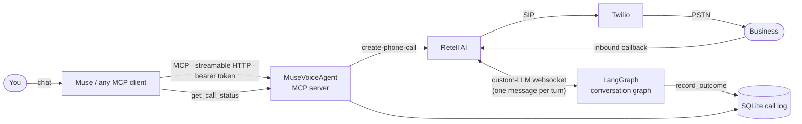
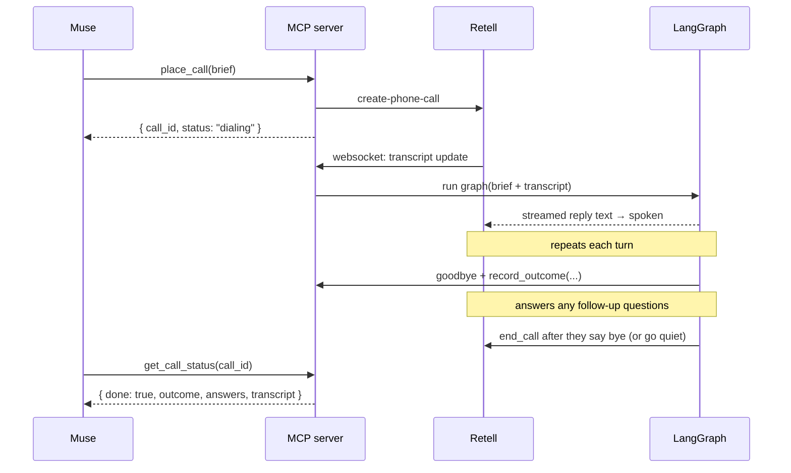

# MuseVoiceAgent

**Give your AI assistant a phone.** MuseVoiceAgent is an [MCP](https://modelcontextprotocol.io) server
that lets an AI assistant (built for Meta Muse, works with any MCP client) phone real businesses on
your behalf. It can place pickup food or drink orders, schedule/reschedule/cancel appointments, book
a table, get a handyman quote, check hotel availability, or ask whether your repair is ready, and it
reports back a structured result.


```text
You    → Muse:  "Call Hotel Zed and ask if they have a king room Oct 10–12 and the rate. Don't book."
Muse   → place_call(business_name="Hotel Zed", assistant_name="Eva", goal=..., questions=[...], authority="info_only")
Agent  ☎  "Hi, this is Eva, an AI assistant calling on behalf of Alex. This call may be recorded. Do you have a king room…"
Hotel  ☎  "We do, $289 a night plus tax."
Agent  → { "outcome": "info_received",
           "answers": [{ "question": "King room Oct 10–12?", "answer": "Yes" },
                       { "question": "Nightly rate?",         "answer": "$289 + tax" }] }
Muse   → You:   "Hotel Zed has a king room for those nights at $289/night plus tax."
```

## 🎧 Hear the first real call

https://github.com/user-attachments/assets/dccc1823-c725-4932-9cc3-eee79d3f62e8

<sub>1:47 · Oct 7, 2026 · captioned, unedited except the employee's name is bleeped ·
🎧 <a href="https://github.com/angilyu/muse-voice-agent/releases/download/demo-first-call/first-real-call.mp3">Audio only</a></sub>

**The errand.** A parent planning a family trip asks Muse: *"Does San Diego Mission Bay Resort
offer childcare so we can go out for a few hours?"* Muse turns that into a brief and calls
`place_call`. Everything after that is the agent, live on the public phone network, with no human
in the loop.

**What happens on the call**

1. **Gets through the phone menu.** It listens to a 30-second recorded menu, picks *"all other
   inquiries"* and presses **4** for the operator. Its opening line is held back, since nobody is
   listening to a recording.
2. **Waits on the line.** It stays silent for about 20 seconds while the front desk rings, then gives
   who it is calling for and why in one sentence.
3. **Can be interrupted.** The clerk cuts in mid-sentence. The agent stops talking at once, listens,
   and carries on.
4. **Doesn't stop at "no".** It moves straight to the brief's fallback (*"do you partner with
   or recommend a local babysitter?"*), then confirms there's no kids' club either. It skips
   the hours and pricing questions, which no longer apply.
5. **Hangs up cleanly and reports back.** It wraps up in under two minutes and returns a
   structured report: all 4 questions answered, nothing committed on the user's behalf, and a
   next step for Muse.

<details>
<summary><b>What Muse got back</b> (trimmed from the real <code>get_call_status</code> response)</summary>

```jsonc
{
  "status": "completed",
  "summary": "Spoke with [name] at the front desk. The resort does not offer in-house childcare, babysitting, or a supervised kids club, and they do not partner with or recommend a local babysitter service for hotel guests.",
  "report": {
    "reached": "person",
    "duration_seconds": 107,
    "ended_by": "business",
    "committed_on_users_behalf": false,
    "answers": [
      { "question": "Does the resort offer childcare, babysitter service, or a supervised kids club …?",
        "answer": "No. They do not offer daytime childcare, babysitting, or a supervised kids club on property." },
      { "question": "What are the hours and pricing?",
        "answer": "Not applicable because no childcare service is offered." },
      { "question": "Will it be available Nov 6-10?",
        "answer": "No childcare service is offered, so there is no availability for Nov 6-10." },
      { "question": "If they have no in-house service, do they partner with or recommend a local babysitter service …?",
        "answer": "No. They do not partner with or recommend a babysitter service; they only partner for baby equipment." }
    ],
    "unanswered_questions": [],
    "next_steps": ["… would need to arrange childcare independently off property if needed for Nov 6-10."]
  }
}
```

Response times on this call, as measured by Retell:

| Stage | p50 | p90 |
|---|---|---|
| Business stops talking → agent starts talking (end to end) | **1.7 s** | 2.3 s |
| LLM (LangGraph turn, first audio chunk) | 1.4 s | 1.9 s |
| Speech recognition | 158 ms | 287 ms |
| Text to speech | 58 ms | 75 ms |

</details>

## Why it's interesting

- **One tool, many errands.** `place_call` takes a *brief* (goal, questions, details it may share,
  and how much authority it has), so you don't build a new flow for every kind of call: orders,
  appointments, cancellations, reschedules, questions, quotes, reservations and status checks.
  Restaurant and handyman calls get tuned shortcuts.
- **Results the assistant can use.** Every call ends with a typed `CallOutcome`: `booked`,
  `quote_received`, `info_received`, `voicemail`, and so on. It includes per-question answers,
  confirmation numbers, and the full transcript.
- **Inbound callbacks.** If a business calls back the Retell number, the agent matches the caller to
  a recent outbound call, answers as the same assistant with the original brief and result as
  context, and links the callback report to the original call. Unknown callers are told this is an
  AI assistant line and can only leave a message.
- **Your code decides what's said, Retell handles the phone audio.** Retell AI does dialing,
  speech-to-text, text-to-speech, barge-in and voicemail detection. A LangGraph graph you control
  writes each reply over Retell's custom-LLM websocket.
- **Guardrails enforced in code.** The agent says it's an AI, only dials allowed number prefixes,
  enforces caps on call length and simultaneous calls, rejects card numbers and SSNs, only shares
  allow-listed personal details, discloses recording by default, and won't report an over-limit or
  unauthorized booking as done.
- **Try it without a phone line.** `DRY_RUN=true` simulates calls end to end, so you can wire up
  your assistant before you have any API keys.
- **Runs on free hosting.** It ships as a ~400 MB Docker image (~95 MB RAM), with a built-in
  keepalive for hosts that sleep when idle, such as Render's free plan.

## How it works



1. The assistant calls a tool such as `place_call`. The server checks the brief, applies its limits,
   asks Retell to dial, and **immediately returns a `call_id`**. Phone calls take minutes, and
   MCP tools shouldn't block that long.
2. Retell connects the call and streams the transcript to the server's websocket. On every turn,
   the LangGraph graph (default `gpt-5.4` with low reasoning effort) reads the conversation and a system prompt built from
   the brief, then streams back what to say next. The first words ("Hi, this is an AI assistant calling
   on behalf of …") are spoken before the model runs. If recording disclosure is enabled, the opener
   also says the call may be recorded. If nobody speaks within `SILENT_PICKUP_MS`
   after pickup (call screeners often wait), the agent speaks first. It can also press keypad digits
   (`press_digits`) for "press 1 to connect" screens and phone menus, and stay quiet on hold
   (`wait_on_hold`).
   Telephony reports a screener, voicemail, phone menu and a person all as "answered", so
   `pickup.py` classifies each business line from its words. The agent answers a screener with who
   and why in one sentence, stays silent while it "connects", and skips the opener on a phone menu.
   When the first person finally says "Hello?" after the agent already spoke into silence, to a
   screener or to a menu, it introduces itself again, since that person never heard it.
3. When the agent has what it needs, it calls `record_outcome`. The goodbye is the tool's first
   argument (`say`), and it is streamed to speech while the rest of the arguments are still arriving,
   so a decision turn needs one model call instead of two. It then stays on the line so it can answer follow-ups (e.g. "how do you spell that?")
   and hangs up (`end_call`) once the business says bye or goes quiet for a few seconds.
   A background monitor also tracks Retell's call state, so calls that end without an outcome
   (no answer, voicemail, hang-up) still get a final result. If the business spoke but hung up
   before the agent recorded the result, for example right after "you're all set", the monitor
   reads the result from the transcript. Its `follow_up` says it was read from the transcript.
4. The assistant polls `get_call_status(call_id)` until `done` is true, then tells you the result.
   If the business calls back later, the inbound call is stored as `direction: "inbound"` with
   `callback_of` pointing to the original `call_id`; the original call's status response includes a
   `callbacks` array with the callback result and report.



## Quickstart (2 minutes, no keys)

Requires Python 3.12+ and [uv](https://docs.astral.sh/uv/).

```bash
git clone https://github.com/angilyu/muse-voice-agent && cd muse-voice-agent
uv sync
cp .env.example .env
echo "MCP_AUTH_TOKEN=$(python -c 'import secrets;print(secrets.token_urlsafe(32))')" >> .env

uv run pytest                                              # unit + MCP tests
uv run muse-voice-mcp                                      # terminal 1: server on :8765
uv run python scripts/smoke_test.py --call +14155550123    # terminal 2: simulated booking
```

The smoke test talks to the server over HTTP exactly as an MCP client would. It lists the tools,
starts a simulated call and polls it until it's done.

## MCP tools

| Tool | What it does |
| --- | --- |
| `place_call` | Phone **any** business with a brief: orders, appointments, cancellations, reschedules, questions, bookings, quotes, availability/status checks |
| `book_restaurant_reservation` | Restaurant shortcut (party size, date, time, flexibility) |
| `request_handyman_quote` | Contractor shortcut: price and earliest availability. **Never books.** |
| `get_call_status` | Status, outcome and structured details; once done, a post-call `report` and the transcript |
| `list_calls` | Most recent calls |

All three call tools **require `customer_name`**, the person the call is made for. The agent opens
with "Hi, this is an AI assistant calling on behalf of {customer_name}. This call may be recorded."
when recording disclosure is enabled. Blank or placeholder names
("user", "unknown", …) are rejected with `invalid_request` so the client asks the user first.

They also take an optional **`assistant_name`**: the calling assistant's own name, e.g. Muse passes
the name the user knows it by. With `"assistant_name": "Eva"` the agent opens with "Hi, this is
Eva, an AI assistant calling on behalf of {customer_name}. This call may be recorded." and answers screeners as "I'm Eva, an AI
assistant calling for …". Without it, the opener stays "Hi, this is an AI assistant calling on behalf
of {customer_name}." Placeholders ("assistant", "AI", "unknown") are ignored; names must be letters
only, up to 40 characters.

### `place_call`: the general-purpose call

```jsonc
{
  "business_name": "Hotel Zed",
  "phone_number": "+15105550123",
  "customer_name": "Wenjing Yu",                           // required: who the call is for
  "assistant_name": "Eva",                                 // optional: the assistant's own name
  "goal": "Find out if they have a king room for Oct 10–12 and the nightly rate",
  "questions": ["Is a king room available Oct 10–12?", "What's the nightly rate?"],
  "shareable_details": { "guests": "2 adults" },          // approved details the agent may say if asked
  "authority": "info_only",                                // or "may_commit_within_limits"
  "limits": null,                                          // required with may_commit unless structured limits are provided
  "max_spend": null,
  "max_deposit": null,
  "max_cancellation_fee": null,
  "allowed_date_time_window": null
}
```

`shareable_details` is an allow-list for personal details. Customer name and callback number are
included by default; email, full address, DOB, insurance/account IDs and similar details are withheld
unless explicitly included for that call. Card numbers, SSNs, passwords and bank/routing details are
always rejected or withheld.

`authority` controls what the agent may commit to. `info_only` (the default) never agrees to
anything. If the model still claims it booked something, the server downgrades the result to
`needs_followup`. `may_commit_within_limits` lets it book, order, schedule, reschedule, cancel or
reserve only within the structured/free-form limits you pass (`max_spend`, `max_deposit`,
`max_cancellation_fee`, `allowed_date_time_window`, party-size range, and/or `limits` notes).
`may_book_within_limits` is still accepted as a backward-compatible alias.

For pickup orders, put the exact items and options in `goal`, `shareable_details`, and especially
`limits`, for example:

```jsonc
{
  "business_name": "HeyTea",
  "phone_number": "+14155550142",
  "customer_name": "Wenjing Yu",
  "goal": "Place a pickup order for two Jasmine green milk teas, 25% sugar, less ice. Use defaults for anything else.",
  "shareable_details": { "pickup name": "Wenjing Yu" },
  "authority": "may_commit_within_limits",
  "limits": "Exactly two Jasmine green milk teas, 25% sugar, less ice, defaults otherwise, pay at pickup only; no card over phone"
}
```

### Result

```jsonc
{
  "call_id": "c_8f2…",
  "status": "completed",          // queued → dialing → in_progress → completed | no_answer | failed
  "done": true,
  "outcome": "info_received",     // booked | ordered | quote_received | info_received | unavailable
                                  // | declined | needs_followup | voicemail
  "summary": "Hotel Zed has a king room Oct 10–12 at $289/night plus tax.",
  "details": {
    "answers": [
      { "question": "Is a king room available Oct 10–12?", "answer": "Yes" },
      { "question": "What's the nightly rate?", "answer": "$289 plus tax" }
    ],
    "contact_person": "Dana at the front desk",
    "reference": null,
    "follow_up": null
  },
  "simulated": false,
  "direction": "outbound",
  "callback_of": null,
  "callbacks": [
    {
      "call_id": "cb_…",
      "direction": "inbound",
      "callback_of": "c_8f2…",
      "status": "completed",
      "outcome": "booked",
      "summary": "The restaurant called back and confirmed the Saturday reservation."
    }
  ],
  "report": {                       // only once done
    "request": { "customer_name": "Wenjing Yu", "goal": "…", "questions": ["…"], "authority": "info_only" },
    "reached": "person",            // person | voicemail | phone_menu | no_answer | not_connected | unknown
    "started_at": "2026-10-05T18:02:11+00:00",
    "ended_at": "2026-10-05T18:03:40+00:00",
    "duration_seconds": 89,
    "end_reason": "The assistant ended the call.",
    "ended_by": "assistant",        // assistant | business | timeout | no_answer | system
    "outcome_source": "agent",      // agent (recorded live) | transcript (inferred after) | call_system
    "committed_on_users_behalf": false,
    "commitment_within_limits": null,
    "safety_flags": [],
    "needs_user_action": false,
    "answers": [                    // one per requested question, in order
      { "question": "Is a king room available Oct 10–12?", "answer": "Yes" },
      { "question": "What's the nightly rate?", "answer": "$289 plus tax" }
    ],
    "unanswered_questions": [],
    "next_steps": ["Share the answers with the user."]
  },
  "transcript": [                   // included by default once done
    { "speaker": "business", "text": "Hotel Zed, this is Dana." },
    { "speaker": "assistant", "text": "Hi, this is an AI assistant calling on behalf of Wenjing Yu…" }
  ]
}
```

The `report` lets the assistant answer follow-ups in the chat ("what time did they say?", "did they
answer the parking question?", "add it to my calendar") without placing another call. Pass
`include_transcript: false` to skip the transcript, or `true` to get it while the call is still in
progress. `list_calls` stays compact and never includes reports or transcripts, but it does include
inbound callback rows so the client can see recent callbacks.

### Retell inbound callback setup

Outbound setup still works as before:

```bash
uv run python scripts/setup_retell.py +1XXXXXXXXXX --public-url https://<your-host>
```

To make the same Retell number answer inbound callbacks, run the setup script with
`--enable-inbound` or set the phone number's `inbound_agent_id` to `RETELL_AGENT_ID` in the Retell
dashboard. Do this only after the deployed server has `PUBLIC_BASE_URL`, `RETELL_WS_SECRET`, and the
current code. Callback matching uses `INBOUND_CALLBACK_LOOKBACK_DAYS` (default 14).

Depending on the call type, `details` can also include `confirmed_date`, `confirmed_time`,
`party_size`, `booked_under`, `order_total`, `pickup_time`, `quote`, and `availability`.

## Design decisions

| Decision | Why |
| --- | --- |
| **Retell for audio, LangGraph for the conversation** (custom-LLM mode) | Retell handles the telephony problems (barge-in, voicemail detection, turn-taking) while prompts, tools and model choice stay in code. Retell doesn't bill for the LLM in this mode. |
| **Start the call and poll, instead of one long blocking tool call** | Calls take 1–5 minutes, and most MCP clients time out long before that. |
| **One brief-driven tool plus a few tuned shortcuts** | New kinds of errands need no code. Common ones keep prompts and validation tuned for them. |
| **Hard rules in code, not only in the prompt** | Dial prefixes, call caps, rejecting sensitive data, and downgrading unauthorized bookings all hold even if the model misbehaves. |
| **A pluggable voice backend** | `VOICE_BACKEND=livekit` runs the same graph on LiveKit Agents (`agent.py`) instead of Retell. |
| **A self-contained server** | One process, SQLite, and no queue or worker fleet, so it runs on a free host. |

## Safety and responsible use

- **Authentication.** Every HTTP request needs `Authorization: Bearer <MCP_AUTH_TOKEN>`;
  `/healthz` is the only open path. Retell's websocket can't send headers, so it uses an
  unguessable path secret (`RETELL_WS_SECRET`), and it only attaches to calls this server started.
- **Who it can call.** `ALLOWED_DIAL_PREFIXES` (default `+1`), `MAX_CONCURRENT_CALLS` (default 3) and
  `MAX_CALL_SECONDS` (default 300).
- **Honest.** Every call opens with a fixed line, "Hi, this is [Eva, ]an AI assistant calling on
  behalf of {name}." It's streamed to text-to-speech before the LLM runs, so the business hears it at once.
  If asked, it always says it's an AI, and it never claims to be human.
- **Discreet.** It never shares payment details, secrets, or unapproved personal details. It only
  shares the `shareable_details` allow-list (customer name and callback number by default).
- **Limits-bound.** It never agrees to deposits, cancellation fees, spend, dates/times, party sizes,
  or other commitments outside the user's authority and limits. Those cases come back as
  `needs_followup` for a human to handle.
- **No sensitive input.** Briefs containing Luhn-valid card numbers or SSNs are rejected before
  dialing. Long order or tracking numbers are still allowed.
- **Recording disclosure.** Recording disclosure is enabled by default. If the business objects,
  the assistant ends politely and reports that the user must follow up. See [docs/safety.md](docs/safety.md)
  for the legal research summary and citations (not legal advice).
- **Check local laws** on AI-voice disclosure and call recording before calling real businesses.
  Recommend that your MCP client confirm with the user before each call. Do not use this for
  telemarketing or sales calls.

## Going live: real phone calls

You need an [OpenAI](https://platform.openai.com) key, a [Retell AI](https://dashboard.retellai.com)
key, and a [Twilio](https://console.twilio.com) account with a voice-capable number.

1. Put `OPENAI_API_KEY`, `RETELL_API_KEY`, `TWILIO_ACCOUNT_SID` and `TWILIO_AUTH_TOKEN` in `.env`.
2. Create the Twilio Elastic SIP trunk and credentials. The script is safe to re-run:
   ```bash
   uv run python scripts/setup_twilio_trunk.py +1XXXXXXXXXX
   ```
3. Expose the server publicly so Retell and your MCP client can reach it. Use a tunnel for
   development, or [deploy it](#deploy).
   ```bash
   cloudflared tunnel --url http://127.0.0.1:8765
   ```
4. Create the Retell agent and import the number. This writes `RETELL_AGENT_ID`,
   `RETELL_FROM_NUMBER`, `RETELL_WS_SECRET` and `PUBLIC_BASE_URL` to `.env`:
   ```bash
   uv run python scripts/setup_retell.py +1XXXXXXXXXX --public-url https://<your-host>
   ```
5. Set `DRY_RUN=false` and start `uv run muse-voice-mcp`. On startup the server points the Retell
   agent at `PUBLIC_BASE_URL`, so after the URL changes you only need to restart.
6. **Call yourself first:** `uv run python scripts/smoke_test.py --call +1YOURCELL`. Answer as the
   business ("Hello, Test Bistro"). The agent waits for you to speak first.

## Deploy

The `Dockerfile` builds only the MCP server, without the LiveKit extra, and listens on `0.0.0.0:10000`.

**Render (free plan works):**
1. Create a **Web Service** from the repo with runtime **Docker**, region **Oregon** (closest to
   Retell), and health check path `/healthz`.
2. Set these environment variables: `DRY_RUN=false`, `VOICE_BACKEND=retell`, `MCP_AUTH_TOKEN`,
   `OPENAI_API_KEY`, `LLM_MODEL`, `RETELL_API_KEY`, `RETELL_AGENT_ID`, `RETELL_FROM_NUMBER`,
   `RETELL_WS_SECRET`, and `PUBLIC_BASE_URL=https://<service>.onrender.com`.
3. Free instances sleep after 15 idle minutes. Set `KEEPALIVE_SECONDS=600` and the server pings its
   own public `/healthz` to stay awake, using about 744 of the 750 free hours a month. Free disks
   are ephemeral, so the SQLite call log resets on each deploy.

Behind a corporate proxy, build with `--build-arg PYPI_INDEX_URL=<mirror>/simple/`.

## Connect your assistant

Point any MCP client at `https://<your-host>/mcp` (streamable HTTP) with the bearer token. For
**Meta Muse**, send one message:

> Build a custom integration to my phone-calling agent. It's an MCP server over streamable HTTP at
> `https://<your-host>/mcp` and needs a bearer token (ask me through the secure credential flow).
> It can call any business for any phone errand: ordering pickup food or drinks, scheduling,
> rescheduling or cancelling appointments, checking status, asking questions, getting quotes, or
> booking within limits I set.
> Connect, list the tools, test `list_calls`, and save it as a reusable skill. Always confirm the
> business, number, and details with me before starting a call, and require my approval for call tools.

Enter `MCP_AUTH_TOKEN` in Muse's secure credential prompt, never in the chat. Then try:

- *"Book a table for 2 at Luigi's (+1…) Friday at 7:30, flexible 6:30–8:30."*
- *"Call HeyTea (+1…) and order two Jasmine green milk teas, 25% sugar, less ice, defaults otherwise."*
- *"Reschedule my dentist appointment from Thursday morning to next Tuesday afternoon if there's no fee."*
- *"Get a quote from Bob's Handyman (+1…) to replace a kitchen faucet in Oakland."*
- *"Ask Joe's Bike Shop (+1…) if my repair is ready. The ticket number is 48213."*

## Configuration

All settings come from environment variables or `.env`; see [`.env.example`](.env.example).

| Variable | Default | Purpose |
| --- | --- | --- |
| `DRY_RUN` | `true` | Simulate calls; no keys or phone line needed |
| `VOICE_BACKEND` | `retell` | `retell` or `livekit` |
| `LLM_MODEL` | `openai:gpt-5.4@low` | Any LangChain `provider:model`, with optional `@reasoning_effort` |
| `MCP_AUTH_TOKEN` | — | Bearer token clients must send |
| `MCP_HOST` / `MCP_PORT` | `127.0.0.1` / `8765` | Bind address (the Docker image uses `0.0.0.0:10000`) |
| `PUBLIC_BASE_URL` | — | Public https URL; the Retell websocket is synced to it |
| `ALLOWED_DIAL_PREFIXES` | `+1` | Comma-separated E.164 prefixes the agent may dial |
| `MAX_CALL_SECONDS` / `MAX_CONCURRENT_CALLS` | `300` / `3` | Limits on call length and simultaneous calls |
| `CALL_RECORDING_ENABLED` | `true` | Whether the backend records calls; when true, the agent discloses recording early |
| `RECORDING_DISCLOSURE_SCOPE` | `always` | `always` (recommended) or `required_states` for known all-party-consent/unknown area codes |
| `LLM_SERVICE_TIER` | `default` | OpenAI service tier. `default` is standard processing. `priority` cuts about 0.1 to 0.9 s per turn but costs about 2x per token, so it's opt-in only |
| `FILLER_AFTER_MS` | `1500` | Retell: say "Hmm," if the model hasn't started speaking a reply to a person by then; `0` disables |
| `SILENT_PICKUP_MS` | `3000` | Retell: if nobody speaks this long after pickup (e.g. a call screener), the agent speaks first; `0` disables |
| `RETELL_VOICE_ID` | `cartesia-Cleo` | Retell voice |
| `DEFAULT_CALLBACK_NUMBER` | — | Used when the client doesn't pass one |
| `DEFAULT_CUSTOMER_NAME` | — | LiveKit console agent only. MCP call tools require the client to pass `customer_name` |
| `KEEPALIVE_SECONDS` | `0` | When greater than 0, the server pings its own `/healthz` at this interval |

## Project layout

```text
src/muse_voice_agent/
  mcp_server.py   MCP tools, bearer auth, /healthz, ASGI app
  tasks.py        Brief models (general, restaurant, handyman), validation, system prompts
  pickup.py       Classifies business lines: screener, voicemail, phone menu, or a person
  graph.py        LangGraph conversation graph, CallControl, and the call tools (record_outcome, end_call, press_digits, wait_on_hold)
  dispatcher.py   Starts calls (Retell, LiveKit, or simulated) and enforces limits
  retell.py       Retell REST client, custom-LLM websocket, call monitor
  outcome_fallback.py  Reads the result from the transcript when a call ends before record_outcome
  agent.py        Optional LiveKit Agents worker (VOICE_BACKEND=livekit)
  store.py        SQLite call log (status, outcome, transcript)
  keepalive.py    Self-ping for hosts that sleep when idle
  config.py       Settings from env
scripts/          Twilio trunk and Retell agent setup, MCP smoke test
tests/            Graph, MCP server, Retell websocket and keepalive tests
```

## Development

```bash
uv run pytest                     # fast; no network or keys needed
uv run muse-voice-agent console   # talk to the graph yourself (LiveKit backend; needs OpenAI + LiveKit keys)
```

Adding a new shortcut takes three steps:
1. Add a brief model and a prompt builder in `tasks.py`.
2. Register a tool in `mcp_server.py`.
3. Add a simulated result in `dispatcher.py`.

Most errands don't need a shortcut, because `place_call` already covers them.

## Evals

The agent is measured by an eval suite of **58 simulated San Francisco Bay Area phone errands**:
restaurants, home services, healthcare, pets, travel, retail and hard cases such as voicemail, IVR
menus and rude hang-ups. The suite is built for hill-climbing prompts, models and graph changes.

- **Text eval:** an LLM plays the business and the real production graph makes the call. The result
  is scored by deterministic safety and outcome checks, TTS-friendliness checks and a six-dimension
  LLM judge. By default it runs on GitHub Copilot models, so iterating costs no OpenAI credits.
- **Voice eval:** scores real Retell calls for latency, barge-ins, dead air and pacing, with an
  optional audio judge.

```bash
uv run --offline python -m evals.text --cases tag:smoke
```

The current baseline is a **62% pass rate** with a **4.24 / 5** average score. See
**[evals/README.md](evals/README.md)** for the case catalog, scoring, model choices, results and
the hill-climbing workflow.

## Roadmap

- [x] Lower turn latency: one model call per decision turn, cache-friendly prompts, filler
- [ ] Lower latency further with a faster model that keeps quality
- [ ] Persistent call log (Postgres or a mounted disk) for hosted deployments
- [ ] Callback handling when a business calls the number back
- [ ] Multi-language calls

## License

Copyright © 2026 Wenjing Yu. All rights reserved. The source is published for reference only; see
[LICENSE](LICENSE). For licensing or commercial use, contact [@angilyu](https://github.com/angilyu).

MuseVoiceAgent is an independent project. It is not affiliated with, endorsed by, or sponsored by
Meta. Muse is referenced only to describe compatibility.
